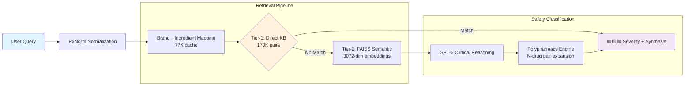
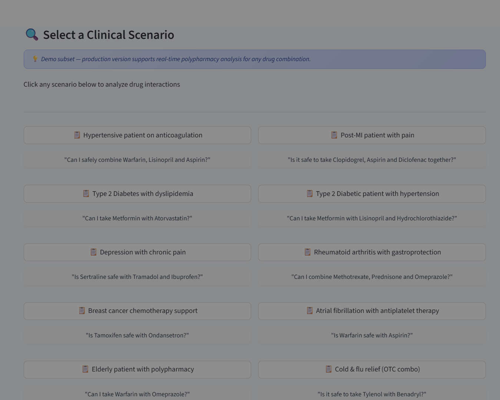
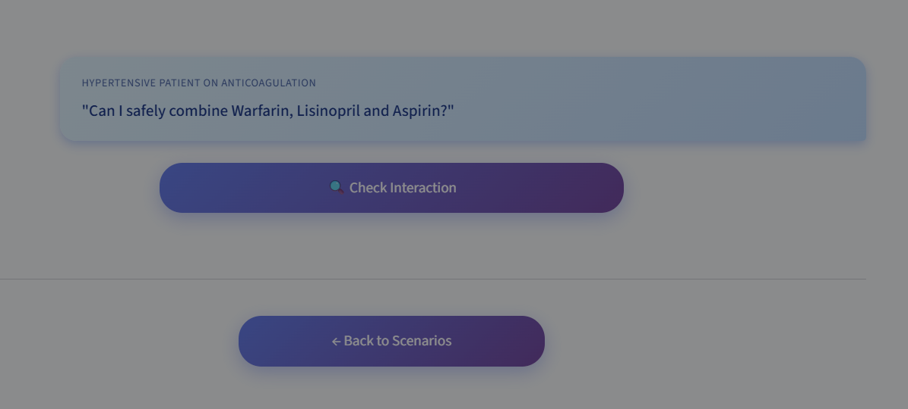
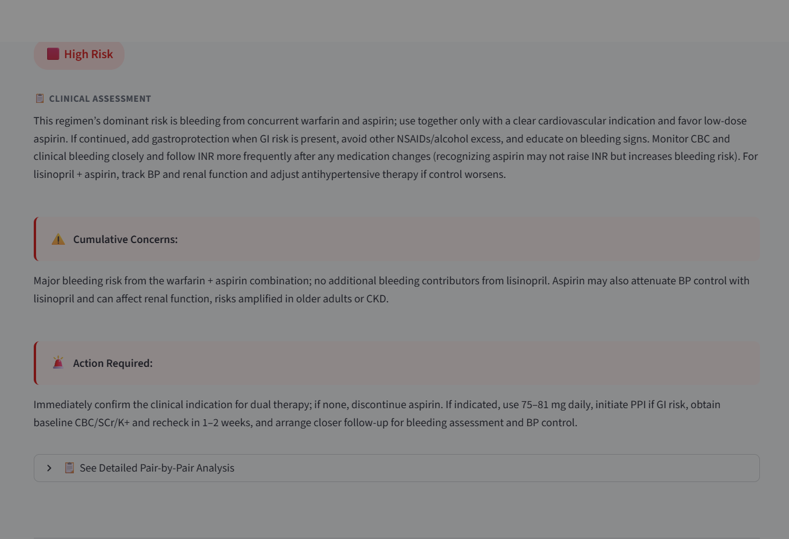
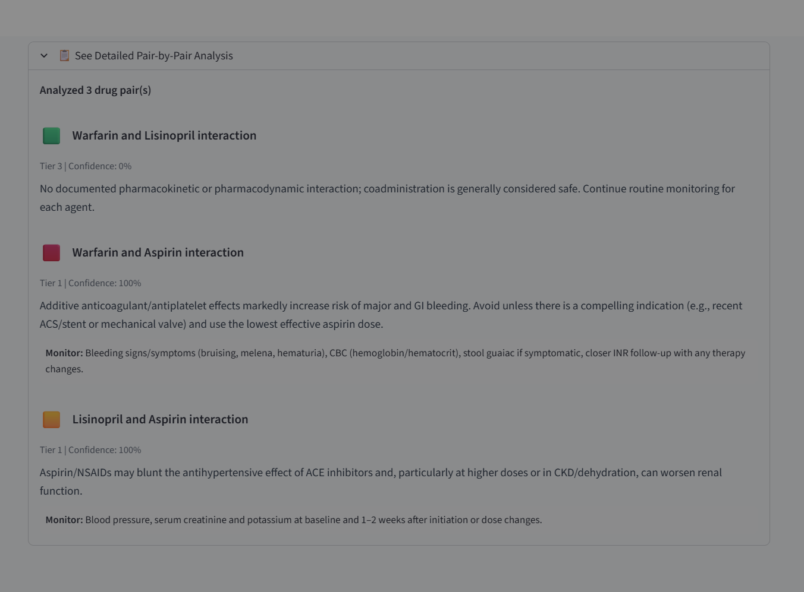

# 💊 Drug Interaction AI

**Clinical-grade polypharmacy intelligence delivering real-time safety analysis across 170,782+ drug interactions — combining RxNorm normalization, FAISS semantic retrieval, and GPT-5 clinical reasoning for hospital-ready medication decision support.**

*By Ridwan Oladipo, MD | Clinical AI Architect*

---

[](https://huggingface.co/spaces/dr-ridwanoladipo/drug-interaction-ai) 
[](https://huggingface.co/spaces/dr-ridwanoladipo/drug-interaction-api)  
[](#-deployment-options)  
[](https://github.com/dr-ridwanoladipo/drug-interaction-ai)

> **Tier-adaptive RAG pipeline unifying 77K+ brand→ingredient mappings with GPT-5 severity classification — from direct KB lookup to semantic fallback to "no-evidence" disclaimers.**
___

## 🎯 Executive Summary
Adverse drug events cause 1.3M+ U.S. emergency visits annually, yet most safety tools miss brand–ingredient variants, semantic mismatches, and cumulative polypharmacy risks.  
This system unifies **170K+ DrugBank interactions** with **77K RxNorm brand→ingredient mappings**, delivers **<200ms direct KB lookups**, and applies **GPT-5 clinical reasoning** to generate color-coded risk flags (🟥🟨🟩) with actionable polypharmacy synthesis.  
Deployed on **AWS Fargate** with **OpenAI embeddings** (benchmarked vs. AWS Bedrock), it's **EHR-ready** via FastAPI and **built to clinical safety standards** for real-time prescribing workflows.

---

## 📊 Performance at a Glance

| Metric | Value | Clinical Impact |
|--------|-------|-----------------|
| **Knowledge Base** | **170,782 DrugBank interactions** | Comprehensive evidence coverage for clinical queries |
| **RxNorm Mapping** | **89.8% pair-level success** | 77K+ brand/synonym names normalized (e.g., Tylenol→Acetaminophen) |
| **Tier-1 Latency** | **<200ms direct lookup** | EHR-compatible real-time response |
| **Semantic Retrieval** | **FAISS 170K vectors (3072-dim)** | Catches rare/similar drug pairs via embeddings |
| **Safety Engine** | **GPT-5 🟥/🟨/🟩 classification** | Color-coded severity with clinical reasoning |
| **Polypharmacy Scale** | **N=10 drugs → 45 pair analysis** | Cumulative risk synthesis (bleeding, QT, CNS) |

___

## 🌐 Deployment Options:
- **Live Demos**: Instant access via HuggingFace (UI + API)
- **Production (On-Demand)**: Fully deployed on AWS ECS Fargate at *drug.mednexai.com* — **available by request**  
>⚡ **AWS Production**: drug.mednexai.com — CI/CD-enabled, <10 minutes cold-start (cost-optimized)

---

## 💼 Business & Clinical Impact
- **Workflow Efficiency**: Automates 15–20 min pharmacist reviews → **8,000+ hours saved annually** (500-bed hospital)
- **Cost Avoidance**: Prevents high-risk ADEs averaging **$50K+ per incident** (litigation + extended LOS)
- **EHR Integration**: **<200ms API** plugs into Epic/Cerner CPOE for real-time prescribing alerts

---

## 🏗️ System Architecture



**Pipeline Metrics:**  
✅ **<200ms** Tier-1 direct lookup | **~5s** full RAG + GPT-5 reasoning    
✅ **DrugBank + RxNorm** clinical standards | **Polypharmacy-aware** cumulative risk analysis

---

## 📖 Development Pipeline

- **[Ingestion Pipeline](https://github.com/dr-ridwanoladipo/drug-interaction-ai/blob/master/notebooks/ingestion.ipynb)**
- **[RAG Pipeline](https://github.com/dr-ridwanoladipo/drug-interaction-ai/blob/master/notebooks/rag_pipeline.ipynb)**
- **[Safety Pipeline](https://github.com/dr-ridwanoladipo/drug-interaction-ai/blob/master/notebooks/safety.ipynb)**
- **[AWS Bedrock Embedding Benchmark](https://github.com/dr-ridwanoladipo/drug-interaction-ai/blob/master/experiments/bedrock_embeddings.ipynb)**

---

## 🎬 Interactive Features

### **Clinical Interface**
- **Chat-style UI** with streaming GPT-5 clinical reasoning (no clunky forms)
- **Color-coded risk flags** (🟥 contraindicated · 🟨 monitor · 🟩 safe)
- **Polypharmacy engine** auto-expands N=10 drugs → 45 pairwise interactions
- **Confidence scoring** (Tier 1: direct KB · Tier 2: semantic · Tier 3: no evidence)
- **Actionable guidance** with cumulative risk synthesis + monitoring parameters

### 🔌 API Integration
Production-grade **FastAPI** with with rate limiting, health checks and Swagger docs.

```bash
# Example: Real-time polypharmacy check
curl -X POST "https://huggingface.co/spaces/dr-ridwanoladipo/drug-interaction-api/api/v1/check-interaction-live" \
     -H "Content-Type: application/json" \
     -d '{"drug_query": "Warfarin, Aspirin and Lisinopril"}'
     
# Interactive docs:
https://dr-ridwanoladipo-drug-interaction-api.hf.space/docs
```

---

## 🖼️ Visual Showcase

### Clinical Scenario Selector
*10 real-world cases spanning cardiology, oncology, psychiatry, and geriatrics*  


### Chat Interface
*One-click interaction check with streaming AI response*  


### Risk Assessment
*GPT-5 severity classification with cumulative concerns and action items*  


### Evidence Breakdown
*Tier-stamped confidence with pharmacologic reasoning and monitoring guidance*  


---

## 🧠 Technical Stack
- **LLM Reasoning:** GPT-5 clinical classifier for mechanism-based severity synthesis  
- **Embeddings:** OpenAI *text-embedding-3-large (3072-dim)* — selected after benchmarking vs. AWS Bedrock Titan V2  
- **Retrieval:** FAISS similarity search over **170K interaction vectors** with lexical pre-filtering  
- **Knowledge Base:** DrugBank interaction evidence normalized into a clinical-grade KB
- **Backend:** FastAPI with rate limiting (SlowAPI), health checks, Pydantic validation, and Swagger docs  
- **Frontend:** Streamlit clinical UI with streaming responses and color-coded risk visualization  
- **Infrastructure:** Docker · AWS ECS Fargate · ECR · GitHub Actions · CloudWatch logging  
- **CI/CD:** Automated deployment with health checks, rollback, and zero-downtime (~5 min git push → production)

---

## 🧪 Clinical Validation & Standards
- **Evidence-based:** DrugBank interactions with RxNorm-standardized ingredient mapping for clinical reliability
- **Tier-adaptive confidence:** Direct KB match → semantic similarity → conservative no-evidence handling  
- **Clinical workflow alignment:** Mirrors pharmacist decision trees with explainable tier logic  
- **Safety compliance:** Built under FDA SaMD principles for medication decision support systems  
- ⚠️ **Clinical disclaimer:** All medical decisions should be made in consultation with qualified healthcare providers

---

## 👨‍⚕️ About the Developer
**Ridwan Oladipo, MD — Medical Data Scientist · Clinical AI Architect**  
Builds **end-to-end medical AI systems** — from deep learning & LLM pipelines (NLP, generative, agentic AI) to **full AWS MLOps deployment** (FastAPI, Docker, ECS Fargate, Bedrock, SageMaker).  
Delivered **7+ production-grade systems** across cardiology, radiology, pharmacology, and multimodal diagnostics, unifying clinical expertise with advanced machine learning and cloud engineering.

**Professional Training:** Stanford University (AI in Healthcare) • Duke University (MLOps) • Harvard University (ML & CS50) • Johns Hopkins University (Generative AI) • University of Oxford (Agentic AI)

### Connect & Collaborate
[](https://mednexai.com)
[](https://linkedin.com/in/drridwanoladipoai)
[](mailto:dr.ridwan.oladipo@gmail.com)

**Open to:** Medical Data Scientist · Clinical AI Architect · Applied ML/MLOps Engineer  
**Collaboration:** Hospitals, AI startups, research labs, telemedicine companies, and engineering teams building real-world medical AI products.
